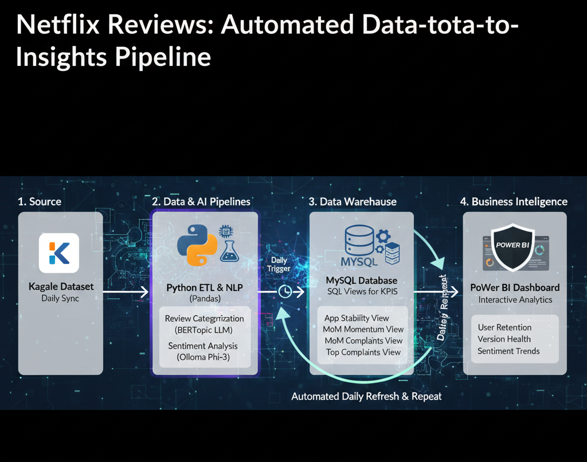

# netflix-sentiment-etl-pipeline

End-to-end data pipeline using Python, BERTopic and Local LLMs to analyze 145k+ Netflix reviews

The Core Challenge: Netflix receives thousands of daily reviews. Standard "Positive/Negative" analysis isn't enough. I built a pipeline that discovers why people are complaining using unsupervised machine learning.

## 🗺️ Project Roadmap
- [x] Phase 1: Python ETL & NLP Sentiment Engine

Technical Highlights:

Automated Sync: Integrated Kaggle API for daily data refreshes.

Incremental ETL: Built a "Delta Load" logic that only processes new reviews, reducing LLM compute time by 90%.

Advanced NLP: Used BERTopic for clustering and Ollama (Phi-3) to generate human-readable labels for thousands of review clusters.

- [x] Phase 2: SQL Data Warehousing and Relational Modeling
I transformed the cleaned Python output into a relational structure to drive deep-dive analytics.

Technical Highlights:

Stability Metrics: Created a v_app_stability view to calculate Failure Rates per version using conditional aggregation.

Momentum Tracking: Utilized Window Functions (LAG) to calculate Month-over-Month (MoM) Rating Delta, identifying exactly when user sentiment shifted.

Root Cause Analysis: Built a CTE-based ranking system to isolate the #1 user complaint for every app release, allowing for targeted product fixes.
- [ ] Phase 3: Brand-Aligned Power BI Executive Dashboard (In Progress)
- [ ] 
